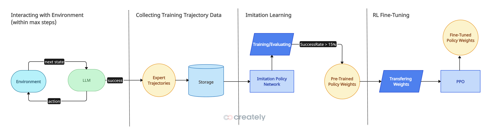
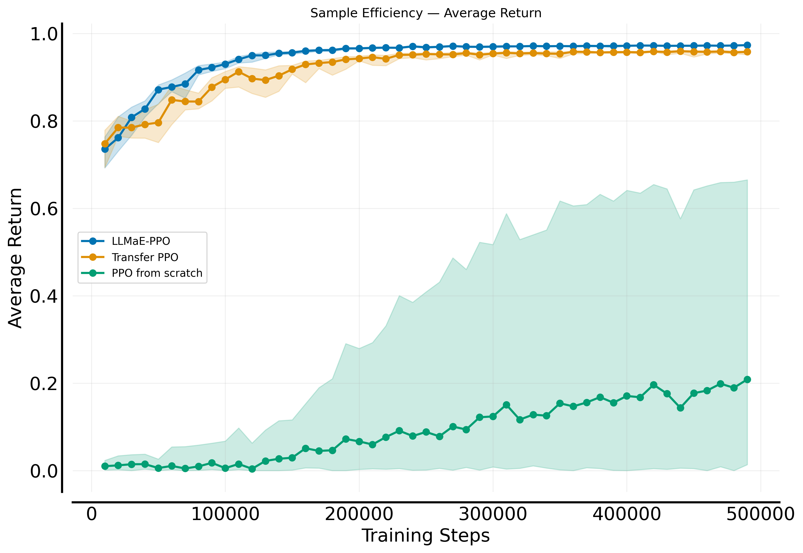
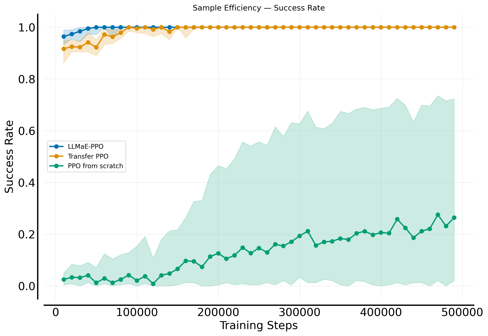

# LLMaE-PPO

**LLM as Expert PPO** is a research project that explores using Large Language Models (LLMs) to initialize reinforcement learning policies. We leverage LLMs to generate expert-like trajectories from natural language task descriptions, then use these trajectories to pretrain PPO (Proximal Policy Optimization) agents via imitation learning.

This approach improves convergence speed and sample efficiency, particularly in environments with difficult exploration or sparse reward signals. The implementation focuses on MiniGrid environments with LLM-in-the-loop trajectory generation.

<p align="center">
  
</p>

## Key Features

- **LLM-based trajectory generation** - Generate expert demonstrations by having LLMs interact with MiniGrid environments
- **Behavior cloning pretraining** - Initialize PPO policies using LLM-generated trajectories  
- **PPO training & evaluation** - Complete RL training pipeline with MiniGrid integration
- **Transfer learning** - Leverage pre-trained models across different environments
- **Comprehensive evaluation** - Rliable metrics (IQM+CI, Time-to-Threshold)
- **Experimental pipeline** - Full data generation, training, evaluation, and visualization workflow

## Quick Start

### Installation
```bash
make install
```

### Usage Flows

This project supports three different training approaches. In order to reproduce the results, please follow the steps below:

#### PPO from Scratch
Train a PPO agent from randomly initialized weights on 10 different seeds

```bash
python llmae_ppo/train.py --config-name=ppo seed=0,7,42,69,73,666,888,9001,314159,1234567 -m
```

#### Transfer Learning (Unlock → DoorKey)
##### 1. Pre-train on Unlock environment (Optional)
Train the agent in the Unlock environment for 150k steps to obtain pre-trained weights. This works well because Unlock is very similar to Doorkey (both require finding a key and unlocking a door) but is simpler, making it a good starting point.

```bash
python llmae_ppo/train.py --config-name=unlock_ppo
```
##### 2. Locate pre-trained weights and copy to `weights` folder (Optional)
After training, navigate to:

```bash
outputs/YYYY-MM-DD/HH-MM-SS/checkpoints
```
This folder is generated by Hydra and find `best_model.pth`.

Then, copy `best_model.pth` to `weights/pretrain_on_unlock/`.

You can skip above steps if you want to use the pre-trained weights already provided in the `weights/` directory.

##### 3. Transfer to DoorKey using pre-trained weights

```bash
python llmae_ppo/train.py --config-name=unlock_to_doorkey seed=0,7,42,69,73,666,888,9001,314159,1234567 -m
```

#### LLM as Expert PPO
Use LLM-generated trajectories for behavioral cloning pre-training, then PPO fine-tuning:

##### 1. Generate expert trajectories with LLM (Optional)
Generate expert trajectories using an LLM - `Llama-3.3-70b-instruct` (via OpenAI API). This approach obtains around 70% success rate for 50 trajectories. 
**Note: This step may take ~1.5 hours and requires OpenAI API access.**

First, create a `.env` file in the project root with your API credentials (we recommend using OpenRouter):

```bash
# .env file
OPENAI_API_KEY=your_api_key_here
OPENAI_BASE_URL=https://openrouter.ai/api/v1  # For OpenRouter
```

Then generate trajectories:

```bash
python llmae_ppo/trajectory_generator.py
```

This will output trajectory data to the `trajectory_data/` folder.

You can skip this step if you want to use the expert trajectories already provided in the `trajectory_data/` directory.

##### 2. Behavioral cloning from LLM trajectories (Optional)

```bash
python llmae_ppo/bc_train.py
```

This trains a behavioral cloning model using the LLM-generated trajectories and saves the model to `weights/bc/bc_model.pth`.

You can skip this step if you want to use the pre-trained BC weights already provided in the `weights/` directory.

##### 3. PPO training with BC-initialized policy

```bash
python llmae_ppo/train.py --config-name=llmae_ppo seed=0,7,42,69,73,666,888,9001,314159,1234567 -m
```

##### Alternative: One Shot Trajectory Generation
Alternatively, we are experimenting with a one-shot trajectory generation method, where the entire environment is described to the LLM. Using Grok-4, this approach achieves high success rates. However, it has a major drawback—Grok-4 takes about 5 minutes to produce a single trajectory, and the cost is very high for just one trajectory since it generates roughly 10–15k reasoning tokens. Detail can be found in the notebook `notebooks/one_shot_solver_demo.ipynb`.

### Configuration

The project uses Hydra for configuration management. Key config files:
- `llmae_ppo/configs/ppo.yaml` - PPO from scratch
- `llmae_ppo/configs/unlock_ppo.yaml` - Pre-training on Unlock environment
- `llmae_ppo/configs/unlock_to_doorkey.yaml` - Transfer learning configuration  
- `llmae_ppo/configs/bc.yaml` - Behavioral cloning parameters
- `llmae_ppo/configs/llmae_ppo.yaml` - LLM as expert PPO configuration

**Examples for overriding parameters:**
```bash
# Override environment or training steps
python llmae_ppo/train.py --config-name=ppo env.name=MiniGrid-Empty-8x8-v0 train.total_steps=100000

# Override BC training epochs
python llmae_ppo/bc_train.py train.num_epochs=50
```

## Monitoring & Evaluation

### Output Structure

#### Single Run Training
When running a single training session, outputs are saved to:
```
outputs/YYYY-MM-DD/HH-MM-SS/
├── checkpoints/
│   ├── best_model.pth      # Best performing model
│   └── last_model.pth      # Final model state
├── eval_logs/
│   ├── PPO_step10000.npz   # Evaluation metrics at step intervals
│   ├── PPO_step20000.npz   # Contains: returns, success rates, masks, eval_seeds
│   └── ...                 # Used for statistical analysis with rliable
├── results/
│   └── training_results_MiniGrid-Environment-v0.png  # Performance plots
├── runs/
│   └── PPO__Environment__seed__timestamp/
│       └── events.out.tfevents.*  # TensorBoard logs
└── train.log               # Training console logs
```

#### Multi-Run Training (with -m flag)
When running multi-seed experiments, outputs are organized as:
```
multirun/YYYY-MM-DD/HH-MM-SS/
├── 0/                      # First seed run
│   ├── checkpoints/
│   ├── eval_logs/
│   ├── results/
│   ├── runs/
│   └── train.log
├── 1/                      # Second seed run
├── 2/                      # Third seed run
├── ...
└── multirun.yaml           # Multirun configuration
```

#### Generated Data & Models
- **LLM trajectories**: `trajectory_data/`
  - `metadata.json` - Trajectory generation metadata
  - `trajectory_*.pkl` - Individual trajectory files
- **Pre-trained models**: `weights/`
  - `bc/bc_model.pth` - Behavioral cloning weights
  - `pretrained_on_unlock/best_model.pth` - Pre-trained on Unlock environment

#### Evaluation Data Format
The `.npz` files in `eval_logs/` contain structured evaluation metrics for statistical analysis:
- **`returns`** - 2D matrix of episode returns for each environment
- **`success`** - 2D matrix of success indicators (1=success, 0=failure/truncation)
- **`mask`** / **`success_mask`** - Boolean masks for valid values (handles variable episode counts)
- **`eval_seeds`** - Random seeds used for each evaluation environment
- **`step`** - Training step when evaluation was performed

These files enable statistical analysis with rliable library for reliable RL evaluation and cross-seed comparisons.


### TensorBoard


#### Collecting TensorBoard Logs for One Experiment
Before starting TensorBoard, collect logs from different seeds for a specific experiment:

```bash
# Create a runs directory for the specific experiment
mkdir -p runs

# Example: Collect logs from Transfer Learning experiment (unlock_to_doorkey)
# Replace YYYY-MM-DD/HH-MM-SS with your actual multirun timestamp
cp -r multirun/YYYY-MM-DD/HH-MM-SS/*/runs/* runs/
```

#### Starting TensorBoard
Once logs from one experiment are collected, start TensorBoard:

```bash
# Start TensorBoard with collected logs from one experiment
tensorboard --logdir=runs
```

Then open your browser and navigate to `http://localhost:6006` to view the training metrics and compare different seeds for that specific experiment.

#### Visualizing Results from Evaluation Logs
To visualize results from evaluation logs, run the following command:

```bash
python llmae_ppo/visualize.py
```
<p align="center">
  
  
</p>
</p>

## Development

### Code Quality
This project uses automated formatting and linting:

```bash
# Format and lint code
make format

# Check code for issues (dry run)
make check

# Run pre-commit hooks
make pre-commit
```

### Available Make Commands
```bash
make help        # Show all available commands
make install     # Install dependencies and pre-commit hooks
make sync        # Sync dependencies only
make format      # Format code with ruff and isort
make check       # Check code for issues (dry run)
make pre-commit  # Run pre-commit hooks
```

### Pre-commit Hooks
Pre-commit hooks automatically format code on commit and include:
- Code formatting with Ruff
- Import sorting with isort

---
